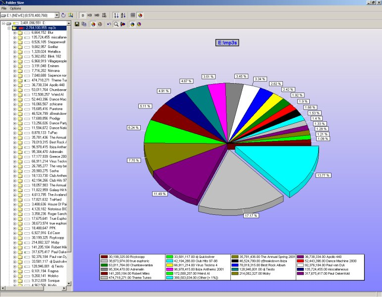

+++
title = "Development: Legacy Projects"
linktitle = "Legacy Projects"
list_subsections = false
[menu.main]
  parent = "development"
  identifier = "development-legacyprojects"
  weight = 2
+++

These are some rather old legacy projects (I mean 20 years some of them).

These may or may not still work.

<table width="97%" border="1" cellspacing="1">
    <thead>
        <tr>
            <th>Title</th>
            <th>Language</th>
            <th>Description</th>
        </tr>
     </thead>
     <tbody>
        <tr>
            <td><a href="files/foldersize.zip">Folder Size</a></td>
            <td>Delphi 6</td>
            <td> 
            <a href="files/foldersize.txt">readme.txt</a> 
            A program to scan your hard disc and work out which files
            and folders are taking up all that space! 
            As an alternative I recommend the superb <a href="http://windirstat.info/">WinDirStat</a></td>

        </tr>
        <tr>
            <td><a href="files/pillman.zip">Pillman</a></td>
            <td>Delphi 6</td>
            <td><a href="files/pillman.txt">readme.txt</a> 
            Pill Man - run around a maze and collect the pills!</td>
        </tr>
        <tr>
            <td><a href="files/crosses.zip">Naughts &amp; Crosses</a></td>
            <td>Delphi 6</td>
            <td><a href="files/crosses.txt">readme.txt</a> 
            A simple naughts and crosses game</td>

        </tr>
        <tr>
            <td><a href="files/boolparser.zip">Boolean Parser</a></td>
            <td>Delphi 6</td>
            <td>Evaluates/Parses boolean expressions</td>
        </tr>
        <tr>
            <td><a href="files/cdfilechk.zip">CD File Checker</a></td>
            <td>Delphi 6</td>
            <td>Scans whole files to check that they can be read
            correctly. Useful for checking a file on a CD has not been
            corrupted.</td>
        </tr>
        <tr>
            <td><a href="files/dos2unix.zip">Dos 2 UNIX</a></td>
            <td>Delphi 6</td>
            <td>Converts Dos text files to UNIX and back again. There
            are plenty of other versions around, but this boasts an easy
            to use interface rather than being command line only.</td>
        </tr>
        <tr>
            <td><a href="files/musgraph.zip">Music Grapher</a></td>
            <td>Delphi 6</td>
            <td>Plays music and draws a time graph and a spectrum. Uses
            the FMOD music library DLL (included)</td>
        </tr>
        <tr>
            <td><a href="files/subaqua.zip">Sub Aqua</a></td>
            <td>Delphi 6</td>
            <td><a href="files/subaqua.txt">readme.txt</a> 
            A simple clone of that old classic game Aqua. Includes a
            simple level editor. 
            Uses the FMOD music library DLL (included)</td>
        </tr>
        <tr>
            <td><a href="files/musgr.zip">Musical Grapher 2</a></td>
            <td>Delphi 6</td>
            <td>Plays mp3s and mod files whilst drawing a 3d spectrum
            time graph. Uses OpenGL so an OpenGL compliant graphics card
            is required.</td>
        </tr>
        </tbody>
</table>
